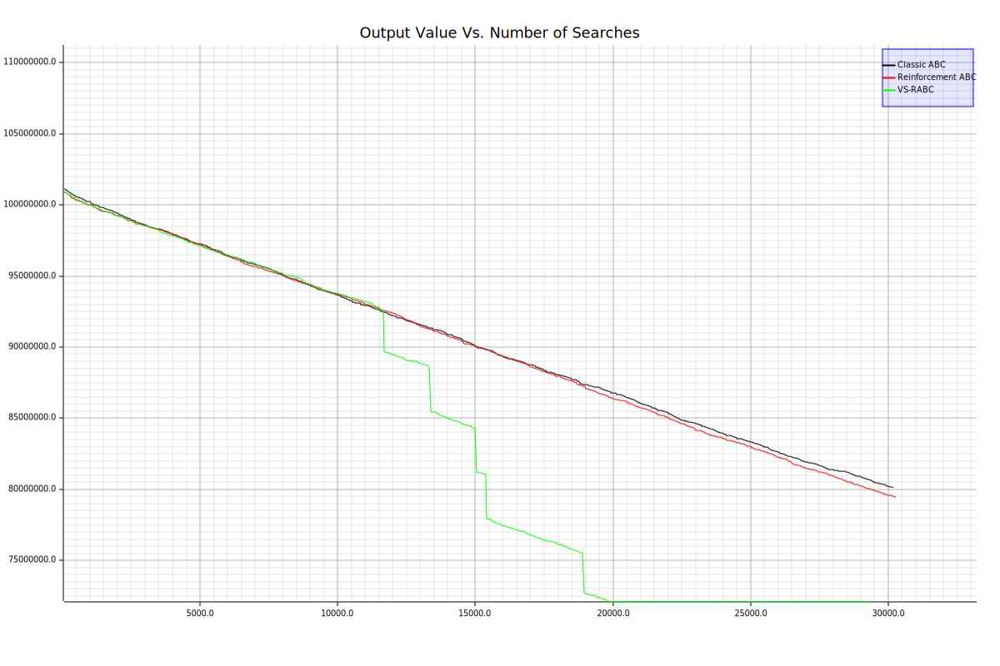
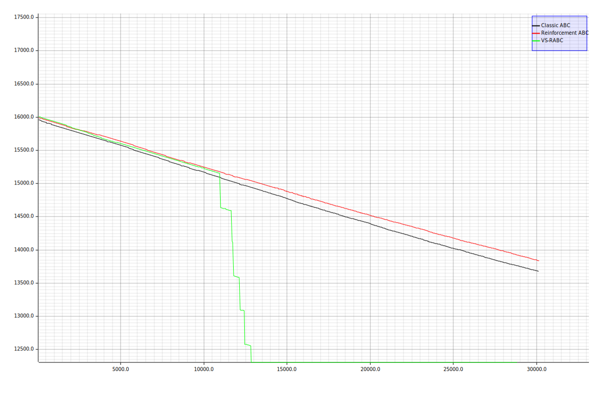

# Rust implementation of Vector-Selection Reinforcement ABC 

- This is a re-implementation of my Master's Degree final Year Project in Rust (see FYP_Masters.docx for further details).

- ABC stands for 'Artificial Bee Colony', a search/optimization algorithm first proposed by Karaboga et al. It is a generalized optimization algorithm that allows us to find the best set of parameters for an optimization problem. Its name is an indication of it drawing inspiration from the behavior of honey-bees when they are searching for food sources.

- RABC is 'Reinforcement Artificial Bee Colony', which is the above algorithm with reinforcement-learning techniques added

- VS stands for 'Vector Selection', which is RABC with randomized vectors pointing away from the Euclidean midpoint of our most recent searches (see FYP_Masters.docx for further details). In theory, this would help us escape behavioral sinks, where the searches end up getting trapped around local minima/maxima.

- Proven faster convergence for benchmarks like the Rosenbrock and Rastrigin benchmark functions:
  |  |
  |:--:| 
  | **Rosenbrock** |

  |  |
  |:--:| 
  | **Rastrigin** |

- The only thing that is necessary is to have a fitness function that outputs datatype f64. This algorithm can search for the best value of your fitness function (it can be an optimization problem or a training model) without any prior knowledge apart from the boundary values of each parameter or dimension.

# How to use
1. Add the below code to your Cargo.toml file in your Rust project:

       [dependencies]
       rust_vs_rabc = {git ="https://github.com/DanielCKL/rust_vs_rabc",branch="main"}

   When building your project for the first time, it will automatically download this project and the necessary dependencies.
3. Import the crate into your code using `use rust_vs_rabc::Optimizer;` at the top of your .rs file. After that, you can use the `Optimizer` struct directly in your code.
4. Set up a new instance of the optimizer. Here, we will name this instance 'optimize_rana':
   
       let mut optimize_rana = Optimizer::new()    //new() method sets up default parameter values
        .minimize()                                //sets the optimizer to search for a minimum value
        .set_limit(20)                             //sets the limit for how many times a possible min/max can be exploited
        .set_thread_pool(2)                        //sets the optimizer to use multiple thread pools in parallel
        .set_traversal_searches(4)                 //Must be an integer 
        .set_search_distance_factor(0.1)           //Represents a fraction of the largest search space range
        .set_search_distance_delta(0.1);           //Represents percentage change in search distance within traversal searches
   
5. Fill in or set the struct fields to customize the running of its methods. Otherwise, default values will be used.
  
       //For example:
       optimize_rana.known_minimum_value = Some(-3070.2475210);
   
   Fields that control the algorithm's behavior and can be assigned directly without using the above setter methods:
   | Field | Behavior controlled |
   | :--- | :--- |
   | permanent_scout_bees | The number of scout bees that are permanently assigned to perform random searches in each iteration |
   | employed_bees | The number of employed bees performing optimization searches around local min/max points |
   | onlooker_bees | The number of onlooker bees stochastically performing optimization searches with likelihood determined by the local min/max point's value|
   | local_limit | The limit for how many times a possible min/max can be exploited without any improvement in the solution value |
   | traversal_searches || Integer value that determines the number of traversal searches (see FYP_Masters.docx for further details) |
   |  search_distance_factor || Percentage change allowed for search distance within traversal searches |
   
   Optional metadata that do not affect the algorithm's behavior:
   | Metadata Field | Purpose |
   | :--- | :--- |
   | fitness_function_name | Name of the fitness function whose problem space we are exploring/searching in to optimize it |
   | fitness_function_description | Description of the fitness function |
   | known_minimum_value | Stores the known minimum value if we already know it, for later reference. |
   | known_minimum_point | Stores the known minimum point(coordinates/set of parameter values) already known. |
   
7. Call the optimization algorithm as below:

           optimize_rana.vs_rabc(
                    &problem_space_bounds, //The problem space bounds (type Vec![f64,f64] (upper bound and lower bound))
                    35u64,                 //Max number of generations to run this algorithm (u64)
                    benchmark_algos::rana, //Fitness function that returns an f64 output.
                                           //If it doesn't return f64, wrap it in another function and only take/cast f64.
                );
   
9. The results will be stored in the `Optimizer` object (`optimize_rana`) that we created earlier. To access them, you can use the following fields:
   | Results Field | Purpose |
   | :--- | :--- |
   | real_time_taken | The time taken for the algorithm to be run. This is hardware-dependent. |
   | searches_made_history | Recorded number of searches made at each iteration |
   | total_searches_made |  The total number of searches made. This is the best overall measure of performance. |
   | min_max_value_history | All the minimum/maximum values returned by the problem function for each iteration |
   | min_max_point_history | All the coordinates/parameter values where the minimum/maximum values were recorded for each iteration |

# Upcoming Work
1. Add logic to allow early stopping of search based on how many iterations went by without an improvement in the minimum or maximum value
2. Add logic to calculate the average number of iterations that the algorithm did not find any new minimum/maximum (palateuated/stagnated around a local minimum)
