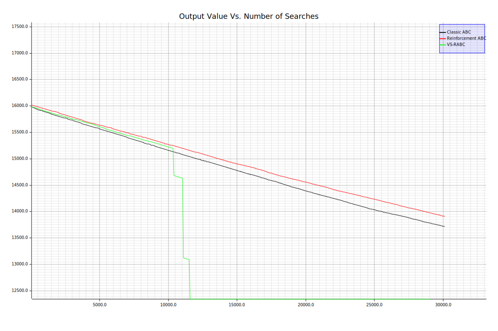

# Rust implementation of Vector-Selection Reinforcement ABC 

- This is a re-implementation of my Master's Degree final Year Project in Rust (see FYP_Masters.docx for further details).

- ABC stands for 'Artificial Bee Colony', a search/optimization algorithm first proposed by Karaboga et al. It is a generalized optimization algorithm that allows us to find the best set of parameters for an optimization problem.

- Faster convergence for benchmarks like the Rosenbrock and Rastrigin benchmark functions:
  |  |
  |:--:| 
  | **Rosenbrock** |

  |  |
  |:--:| 
  | **Rastrigin** |

- The only thing that is necessary is to have a fitness function that outputs datatype f64. This algorithm can search for the best value of your fitness function (it can be an optimization problem or a training model) without any prior knowledge apart from the boundary values of each parameter or dimension.

# How to use
1. Add the below code to your Cargo.toml file in your Rust project:

       [dependencies]
       rust_vs_rabc = {git ="https://github.com/DanielCKL/rust_vs_rabc",branch="main"}

   When building your project for the first time, it will automatically download this project and the necessary dependencies.
3. Import the crate into your code using `use rust_vs_rabc::Optimizer;` at the top of your .rs file. After that, you can use the `Optimizer` struct directly in your code.
4. Set up a new instance of the optimizer. Here, we will name this instance 'optimize_rana':
   
       let mut optimize_rana = Optimizer::new()    //new() method sets up default parameter values
        .minimize()                                //sets the optimizer to search for a minimum value
        .set_limit(20)                             //sets the limit for how many times a possible min/max can be exploited
        .set_thread_pool(2)                        //sets the optimizer to use multiple thread pools in parallel
        .set_traversal_searches(4)                 //Must be an integer 
        .set_search_distance_factor(0.1)           //Represents a fraction of the largest search space range
        .set_search_distance_delta(0.1);           //Represents percentage change in search distance.
   
5. Fill in or set the struct fields to customize the running of its methods. Otherwise, default values will be used.
  
       //For example:
       optimize_rana.known_minimum_value = Some(-3070.2475210);
   
   Fields that can affect the run:
   - permanent_scout_bees
   - employed_bees
   - onlooker_bees
   - local_limit
   - traversal_searches
   - search_distance_factor
   Optional fields that do not affect the run, and that can be added for further reference
   - fitness_function_name
   - fitness_function_description
   - known_minimum_value
   - known_minimum_point
7. Call the optimization algorithm as below:

           optimize_rana.vs_rabc(
                    &problem_space_bounds, //The problem space bounds (type Vec![f64,f64] (upper bound and lower bound))
                    35u64,                 //Max number of generations to run this algorithm (u64)
                    benchmark_algos::rana, //Fitness function that returns an f64 output.
                                           //If it doesn't return f64, wrap it in another function and only take/cast f64.
                );
   
9. The results will be stored in the `Optimizer` object (`optimize_rana`) that we created earlier. To access them, you can use the following fields:
- real_time_taken        = The time taken for the algorithm to be run. This is hardware-dependent.
- searches_made_history  = Recorded number of searches made at each iteration
- total_searches_made    = The total number of searches made. This is the best overall measure of performance.
- min_max_value_history  = Stores all the minimum/maximum values returned by the problem function for each iteration
- min_max_point_history  = Stores all the coordinates/parameter values where the minimum/maximum values were recorded for each iteration

# Upcoming Work
1. Add logic to allow early stopping of search based on how many iterations went by without an improvement in the minimum or maximum value
2. Add logic to calcualte the average number of iterations that the algorithm did not find any new minimum/maximum (palateuated/stagnated around a local minimum)
